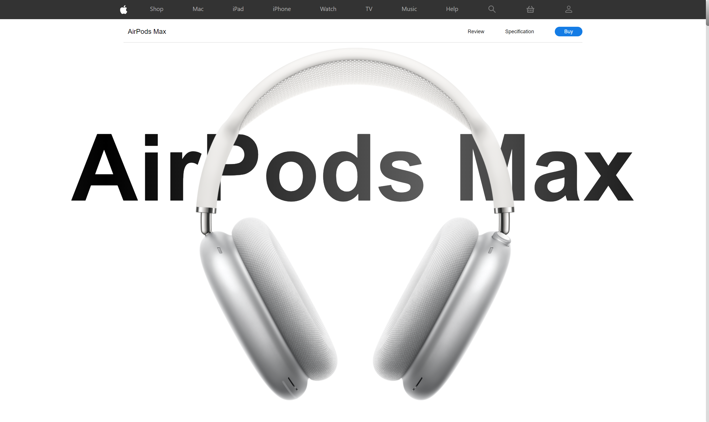
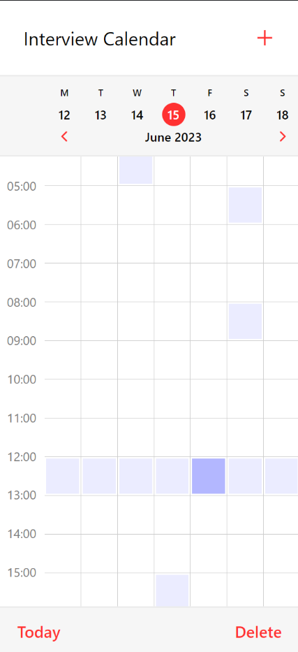
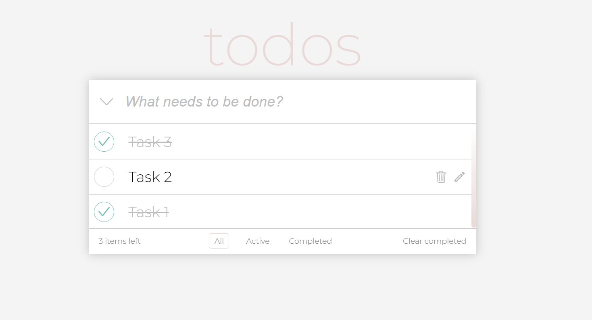

    

        <h1>👋 Hello, I'm Vladimir</h1>
        <h3>📈 Fullstack .Net Developer (.Net/React/Python)</h2>
        
Welcome to my GitHub profile README! Here you'll find information about my skills, projects, and contact details.

    

    

        <h1>🔧 Skills</h2>
        <ul>
            <h2>Backend C#</h2>
            <li>C#</li>
            <li>.NET</li>
            <li>ASP.NET Core</li>
            <li>LINQ</li>
            <li>Entity Framework</li>
            <li>SQL</li>
            <li>Hangfire</li>
            <li>Apache Kafka</li>
            <li>RabbitMQ</li>
            <h2>Frontend</h2>
            <li>JavaScript</li>
            <li>TypeScript</li>
            <li>React</li>
            <li>Tanstack (React-Query, React-Table)</li>
            <li>NextJs</li>
            <li>UI Libraries (material ui, devExtreme, radix-ui, shadcn/ui)</li>
            <li>State managers (zustand, redux-toolkit, react context)</li>
            <h2>Backend Python</h2>
            <li>Python</li>
            <li>Django</li>
            <li>FastApi</li>
            <li>SQLAlchemy</li>
            <li>Aiogram</li>
            <li>SQL</li>
            <h2>Another tools</h2>
            <li>PostgreSQL</li>
            <li>Microsoft SQL Server</li>
            <li>Docker</li>
            <li>Linux</li>
        </ul>
    

    

        <h1>💼 Projects</h2>
        <ul>
            <li>
                <h2>Helpdesk</h2>
                                
                <h4>📝 Description: </h4>
                This application facilitates the creation and approval of requests within departments of large companies, aiming to streamline communication and collaboration. Key features include user roles (Administrator and User), request template management, request creation based on templates, file attachments, request filtering and history, viewing and editing existing requests, notifications, decision-making, organizational hierarchy, user management, request categories, responsible parties for each category, comments, and system notifications.
                <h4>🚀 Language Stack: </h3>
                <b>front: </b>TypeScript, React, DevExtreme components
                 
                <b>back: </b> C#, ASP.Net core, Entity Framework
                 
                <b>database: </b> PostgreSQL
                <h4>🔓 Open code: </h4>
                front - <a href="https://github.com/valdemar-leontev/helpdesk-front">Helpdesk Front</a>
                 
                back - <a href="https://github.com/valdemar-leontev/helpdesk-back">Helpdesk Back</a>
                <h4>📱 App: </h4> 
                <a href="">Helpdesk</a>
            </li>
            <li>
                <h2>Apple Site Front</h2>
                                
                <h4>📝 Description: </h4>
                This site is an approximate copy of Apple's site, which contains AirPods Max headphones. The site has a beautiful and pleasant animation, many pages and spreads, the ability to add products to the cart and create your own AppleId.
                <h4>🚀 Language Stack: </h3>
                <b>front: </b>JavaScript, React
                <h4>🔓 Open code: </h4>
                front - <a href="https://github.com/valdemar-leontev/AppleReact">Apple Site Front</a>
                <h4>📱 App: </h4> 
                <a href="https://apple-site-air-pods-max.netlify.app">Apple Site Front</a>
            </li>
             
            <li>
                <h2>Test Project for Interview at Uchi.ru Company:</h2>
                    <h2>1. Interview Calendar</h2>
                     
                    <h4>📝 Description: </h4>
                    Interview calendar for Uchi.ru. The Interview Calendar is a web-based tool designed to make scheduling easier.
                    <h4>🚀 Language Stack: </h3>
                    <b>front: </b>TypeScript, React
                    <h4>🔓 Open code: </h4>
                    front - <a href="https://github.com/valdemar-leontev/uchi-ru-interview-calendar-front">Interview Calendar</a>
                    <h4>📱 App: </h4> 
                    <a href="https://uchi-ru-interview-calendar.netlify.app/">Interview Calendar</a>
            </li>
             
            <li>
                    <h2>Test Projects for Interview at Mindbox Company: </h2>
                    <h2>1. ShapeSquares</h2>
                    <h4>📝 Description: </h4>
                    The Mindbox.ShapeSquares project is an API for calculating the areas of geometric shapes. It includes the core library with the logic for area calculations, tests to ensure functionality, and a web interface for obtaining shape areas through HTTP requests.
                    <h4>🚀 Language Stack: </h3>
                    <b>back: </b>C#, ASP.Net core
                    <h4>🔓 Open code: </h4>
                    <b>back: </b> <a href="https://github.com/valdemar-leontev/Mindbox.ShapeSquares">ShapeSquares</a>
                    <h2>2. ToDo List</h2>
                     
                    <h4>📝 Description: </h4>
                    A simple application for creating, modifying and deleting tasks and also filtering them depending on their status. This application stores tasks in LocalStorage, which allows users to use this application with complete confidence that they will not lose their data if they reboot or unsuccessfully shut down the computer.
                    <h4>🚀 Language Stack: </h3>
                    <b>front: </b>TypeScript, React, Redux
                    <h4>🔓 Open code: </h4>
                    <b>front: </b> <a href="https://github.com/valdemar-leontev/mindbox-todo">ToDo List</a>
                    <h4>📱 App: </h4> 
                    <a href="https://mindbox-todo.netlify.app/">ToDo List</a>
            </li>
        </ul>
    

    

        <h1>🌱 Interests</h1>
        <ul>
            <li>Web Development</li>
            <li>New Technologies</li>
        </ul>
    

    

        <h1>📫 Contact</h1>
        <ul>
        <li>Email: <a href="mailto:valdemar.leontev@gmail.com">valdemar.leontev@gmail.com</a></li>
        <li>Telegram: <a href="https://t.me/Mr_LeonWhite">Telegram Profile</a></li>
        </ul>
    

    

        
Thank you for visiting my profile README! If you have any questions or suggestions, feel free to contact me. I'm open to collaborations and discussions.

        
Have a great day!

    

